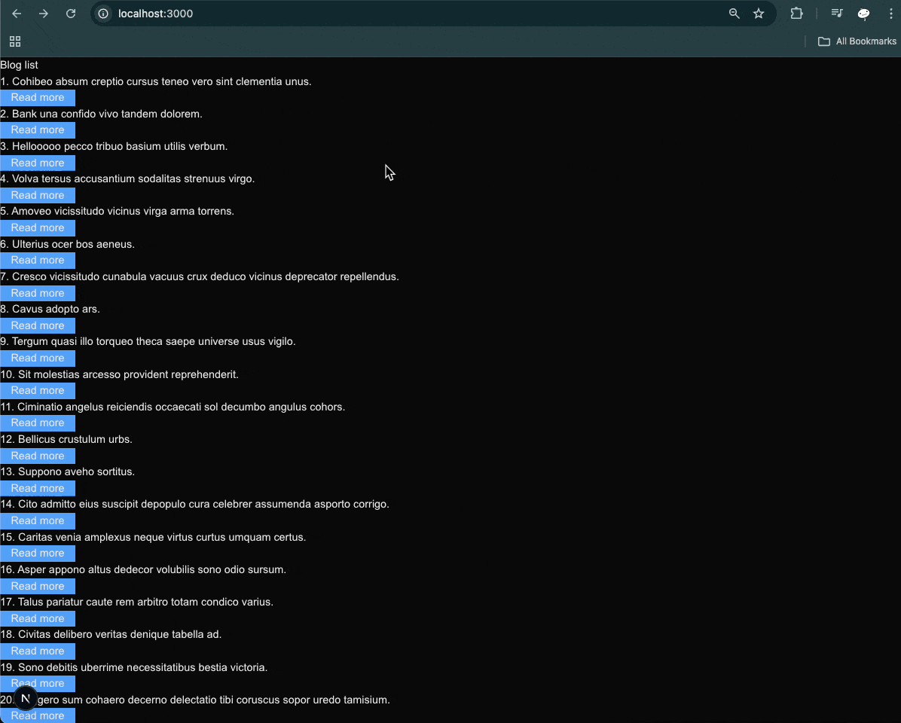
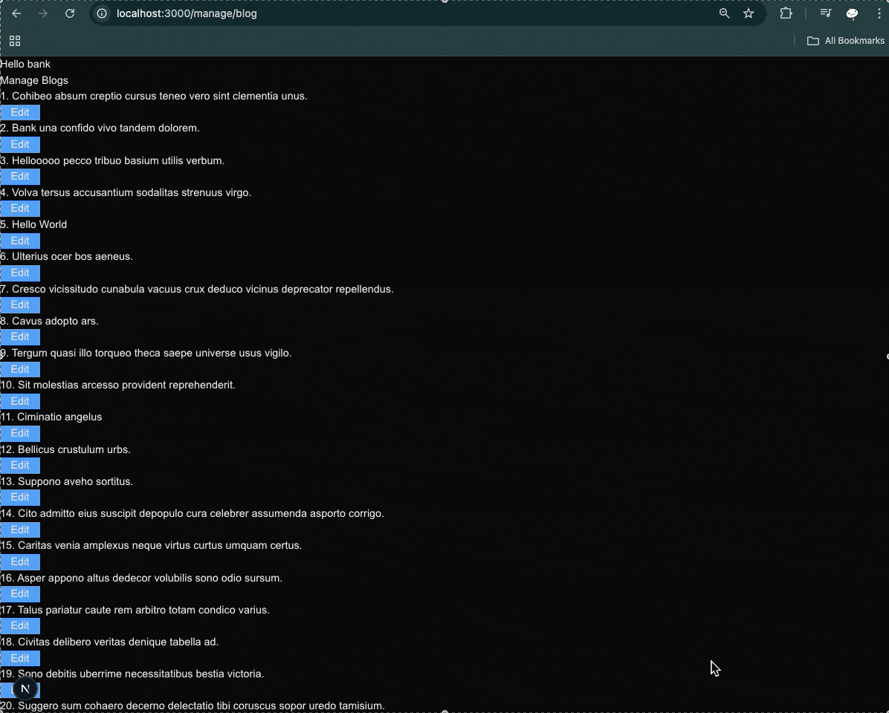
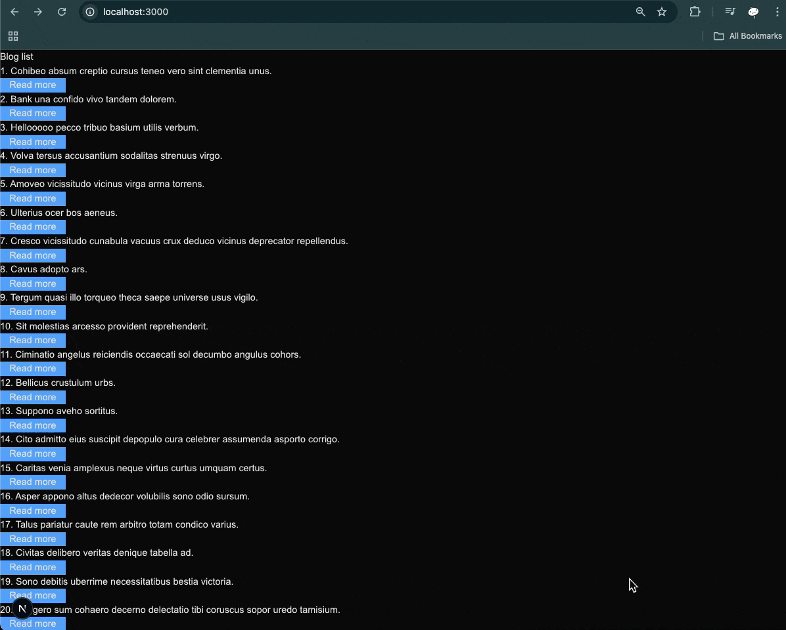

<h3 align="center">Next.js Blog App</h3>

## ⚠️ Note

This project was implemented based on a tutorial video on YouTube from mikelopster
[ลอง Next.js 14 แบบ Quick overview กัน](https://www.youtube.com/watch?v=e8-WmjKdfRo).

## Table of Contents

1. [Introduction](#introduction)
2. [Demo](#demo)
3. [Tech Stack](#tech-stack)
4. [Quick Start](#quick-start)
5. [What I learned](#learn)

## <a name="introduction">Introduction</a>

The project idea is to create a blog app that will be used by 2 groups of users

- Admin ( hard code with username "bank" and password "1234")
  - need to sign in to access the blog management page
  - can edit blog name only
- User
  - can browse blog only

Just a begining step to understand more about `next.js`

## <a name="demo">Demo</a>

#### Admin Login

<a href="">
  
</a>

#### Admin Update Blog Name

<a href="">
  
</a>

#### User Browse Blog

<a href="">
  
</a>

## <a name="tech-stack">Tech Stack</a>

- Next.js v15 - as a framework
- jose - as a JWT library for authentication
- mockapi.io - as a CRUD API backend, database, and generate mock data
- tailwindcss - as a CSS framework for styling

## <a name="quick-start">Quick Start</a>

Follow these steps to set up the project locally on your machine.

**Prerequisites**

- Git
- Node.js
- npm

**Cloning the Repository**

```bash
git clone https://github.com/bank8426/try-next.git
cd try-next
```

**Installation**

Install the project dependencies using npm:

```bash
npm install
```

**Set Up Environment Variables**

1. Create a new file named `.env.local` and copy content inside `.env.example`
2. Replace the placeholder values with your actual credentials

```env
# https://mockapi.io/projects create project and resource
# this variable will available in server-side only
MOCKAPI_BASE_URL=
# this variable will available in client-side only since it starts with NEXT_PUBLIC_
NEXT_PUBLIC_MOCKAPI_BASE_URL=

# https://www.npmjs.com/package/jose just put random string for learning purpose but for production use function to generate secure string
JOSE_SECRET=
```

**Running the Project**

```bash
npm run dev
```

Open [http://localhost:3000](http://localhost:3000/) in your browser to view the project.

## <a name="learn">What I learned</a>

- next.js has a lot of thing built-in such as

  - `router` something similar to `react-router`. But it use `folder structure` to define routes instead of `index.js` or `route.js`.
  - `middleware` is a function that runs before the request is processed, it can be used for `authentication` checking
  - `next.config.mjs` is a configuration file for next.js. for this project I need to add `remotePatterns` for `picsum.photos` to allow loading images from `external sources`

- `jose` is a library that allows you to create a JWT `token` for authentication and authorization.

- Authentication process to get JWT token

  1. User login with `username` and `password` (I used hardcodeed username and password which is `bad practice`)
  2. Server validate the credentials
  3. If valid, server creates `secret key` based on JWK (JSON Web Key) which include `JOSE_SECRET` environment variable and then use it to sign the JWT `token` which include user's `email` and set it to expire in 1 hour from the issue time, then store it in `cookie`

- JWT token verification process to make sure user's token is valid

  1. In `middleware`, server gets `token` from `cookie`

  2. Server uses same `secret key` to verify the `token` which will return correct `payload` if `token` signed with same `secret key`

     - in `jwtVerify()` from `jose` library will auto check `exp` (expiration time) and throw an error if the `token` expired

  3. If `email` in `payload` is invalid (`email` !== `bank`), the server will redirect to the `login` page
  4. If `email` in `payload` is valid, the server will add `user` to `request headers` and continue to the destination page

- `mockapi.io` , I used it in my previous project
  [try-react-vite](https://github.com/bank8426/try-react-vite). But this time I also use it to add `mock image` (from picsum.photos) for blog.

- `tailwindcss` is a CSS framework for building custom designs. It come with light and dark mode. But i still need to learn more since add it to project will clean up all of html element's css.
  - Such as `h1` tag will not has any styling and look like `p` tag
